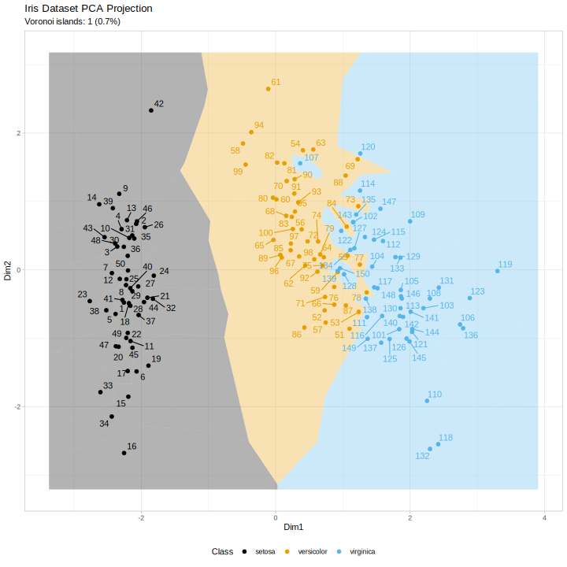

# Voronoi tessellation as a complement or replacement for confidence ellipses in the visualization of data projection and clustering results


This repository contains R code and examples demonstrating Voronoi tessellation visualization of 2D raw or projected data, as presented in the accompanying scientific paper.

## Overview

Voronoi tessellation provides an intuitive visualization of class separation and decision boundaries in raw data, or projected data from dimensionality reduction techniques such as PCA, PLS-DA, UMAP etc. By dividing the plot space into regions based on proximity to data points, Voronoi diagrams effectively display clustering results and classification boundaries.

## Main functions

The package provides two main functions for generating tessellation-based visualizations of multivariate data.  
Both share most parameters for plot style and data input, but differ in the type of output they produce.

---

### 1. `create_tesselation_plots()`

Generates standard 2D plots with optional confidence ellipses and Voronoi tessellation overlays.  
Returns a **list of ggplot objects** that combine scatterplots, ellipses, and Voronoi diagrams.

### 2. `create_voronoi_plot()`

Generates standalone Voronoi tessellation plots with optional dual class assignments.  
Returns a **single ggplot object** containing the tessellation.

---

### Shared parameters

| **Parameter** | **Type** | **Default** | **Description** |
|----------------|-----------|--------------|-----------------|
| `data` | data.frame | – | Data with ≥2 numeric columns for coordinates |
| `class_column` | character / vector | NULL | Column name or vector of class labels |
| `alternative_class_column` | character / vector | NULL | Alternative column name or vector of class labels |
| `coordinate_columns` | character vector | NULL | Columns to use as coordinates (if NULL, uses first two numeric columns) |
| `case_labels` | character vector | NULL | Individual case labels (uses row numbers if NULL) |
| `coord_names` | character vector | c("Dim1", "Dim2") | Names for coordinate axes |
| `title` | character | NULL | Plot title |
| `show_labels` | logical | FALSE | Whether to show case labels |
| `voronoi_alpha` | numeric | 0.3 | Transparency of Voronoi regions (0–1) |
| `point_size` | numeric | 2 | Size of data points |
| `legend_position` | character / numeric | "bottom" | Position of the legend |
| `color_palette` | function / character | NULL | Custom color palette |
| `add_grid_lines` | logical | FALSE | Whether to add origin grid lines |
| `color_points` | character | "primary" | Which classification to use for point colors ("primary" or "alternative") |
| `fill_voronoi` | character | "primary" | Which classification to use for Voronoi fills ("primary" or "alternative") |
| `point_shape` | character | "none" | Shape of data points ("primary", "alternative", or "none") |
| `label_fontface` | character | "plain" | Font face for case labels ("plain", "bold", "italic", "bold.italic") |
| `label_size` | numeric | 3.88 | Size of case labels |
| `show_island_count` | logical | FALSE | Whether to show the Voronoi island count as a plot subtitle |
| `label_islands_only` | logical | FALSE | Whether to show case labels only for Voronoi islands |

---

### Outputs

| **Function** | **Output** | **Type** | **Description** |
|---------------|-------------|-----------|-----------------|
| `create_tesselation_plots()` | `result$scatter_plot` | ggplot | Standard scatter plot of the projected data |
|  | `result$voronoi_plot` | ggplot | Voronoi tessellation plot with data points |
|  | `result$combined_plot` | ggplot | Combined visualization with additional features |
| `create_voronoi_plot()` | *return value* | ggplot | A single Voronoi plot with optional dual classification and grid overlays |

## Examples
The repository includes example scripts demonstrating the application of Voronoi tessellation to various data types:

### Iris dataset PCA visualization

This example demonstrates **Principal Component Analysis (PCA)** followed by **Ward's hierarchical clustering** on the classic *Iris* dataset (Anderson, E. (1935). The irises of the Gaspé peninsula. Bulletin of the American Iris Society 59, 2–5; Fisher, R.A. (1936). The use of multiple measurements in taxonomic problems. Annals of Eugenics 7, 179-188. 10.1111/j.1469-1809.1936.tb02137.x.). The figure below shows the data projected into the first two principal components, with species classes (left) and Ward clusters (right) highlighted for comparison. The middle and right hand panels show that the clustering does not agree with the original class structure of the three species; in other words, it is a poor clustering result when assuming that the dataset's structure follows the prior classification into three species.



**Voroni tessellation and single-case labelling of a PCA projection of the iris flower dataset**. Points/regions: Individual flower samples projected in PCA space. *Axes*: Principal components PC1 and PC2, which capture the majority of variance.

*Point colors*: Left panel: Iris species (setosa, versicolor and virginica), middle panel: Ward clusters, right panel: Iris species. 

*Cell colors*: Left and middle panels: Iris species (setosa, versicolor, virginica), right panel: Ward clusters.


**Voronoi Islands** (1 island, 0.7% rate)  
A *Voronoi island* is a data point whose Voronoi cell is completely surrounded by cells of a different class. Every neighbor belongs to a different species, making it the strongest local signal of class discordance in the tessellation. This metric is unique to Voronoi diagrams and quantifies class structure disruption visible in the plot.


### Examples used in the paper (see Citation):
- **`covid_metaboanalyst_example.R`**: COVID-19 metabolomics data from MetaboAnalyst (PCA projections)
- **`pain_data_example.R`**: Quantitative sensory testing pain data with multiple projection methods (PLS-DA, PCA, UMAP)
- **`PsA_data_example.R`**: Psoriatic arthritis lipidomics data (PLS-DA projections)

- **`Two_class_artifical_data_example.R`**: Artificial two-class data with controlled separation and scenarios with/without classification errors
- **`Three_class_artifical_data_example.R`**: Artificial three-class data demonstrating multi-class visualizations
- **`Lsun_example.R`**: FCPS Lsun dataset illustrating Voronoi tessellation with multiple clustering algorithms (k-means and single linkage)

## Data

The `data/` directory contains three datasets:

### Lsun_OriginalData.csv
Two-dimensional clustering benchmark with 400 samples in three classes (FCPS dataset). Used in `Lsun_example.R`.

**Reference**: Ultsch A, Lötsch J. The fundamental clustering and projection suite (FCPS): A dataset collection to test the performance of clustering and data projection algorithms. Data. 2020;5(1):13. doi: https://doi.org/10.3390/data5010013

### QSTpainEJP.csv
Quantitative sensory testing (QST) data with 22 pain measures from 72 healthy subjects. Used in `pain_data_example.R`.

**Public access**: https://data.mendeley.com/datasets/9v8ndhctvz/2 (DOI: 10.17632/9v8ndhctvz.2)

**References**: Lötsch J, Dimova V, Ultsch A, et al. Eur J Pain. 2016;20(5):777-89. doi: 10.1002/ejp.803 | Rolke R, Magerl W, Campbell KA, et al. Eur J Pain. 2006;10(1):77-88. doi: 10.1016/j.ejpain.2005.02.003

### PsA_tests_data_complete.csv
Lipidomcs data (292 plasma lipid profiles) from 81 patients diagnosed with psoriatic arthritis (PsA) and 26 healthy control subjects. Used in `PsA_data_example.R`. 

**Public access**: https://data.mendeley.com/datasets/32xts2zxdc/1 (DOI: 10.17632/32xts2zxdc.1)

**References**: Lötsch J, Gurke R, Hahnefeld L, Behrens F, Geisslinger G. Psoriatic Arthritis (PsA) Clinical Lipidomics Dataset with Hidden Laboratory Workflow Artifacts: A Benchmark Dataset for Data Processing Quality Control in Lipidomics. Data. 2026;11(2):32. doi:10.3390/data11020032

### covid_metabolomics_pca_score.csv
PCA scores from LC-MS metabolomics data of 59 samples (20 controls, 39 COVID-19 patients). Used in `covid_metaboanalyst_example.R`.

**Data source**: https://api2.xialab.ca/api/download/metaboanalyst/covid_metabolomics_data.csv

**Reference**: Pang Z, Lu Y, Zhou G, et al. MetaboAnalyst 6.0: towards a unified platform for metabolomics data processing, analysis and interpretation. Nucleic Acids Res. 2024;52(W1):W398-w406. doi: 10.1093/nar/gkae253

### Additional datasets
- **PsA lipidomics**: Used in `PsA_data_example.R`
- **Artificial data**: Generated in `Two_class_artifical_data_example.R` and `Three_class_artifical_data_example.R`

## Dependencies

The code requires:
- `ggplot2` (plotting)
- `cowplot` (plot arrangement)
- `deldir` (Voronoi tessellation computation)
- `ggrepel` (smart label positioning)
- `MASS` (ellipse computation)

Optional packages for specific examples:
- `mixOmics` (PLS-DA and PCA projections)
- `umap` (UMAP dimensionality reduction)

## Note on the VoronoiBiomedPlot R Package

This code repository also serves as the basis for the published R package [VoronoiBiomedPlot](https://cran.r-project.org/package=VoronoiBiomedPlot), available on CRAN, which provides a packaged version of these functions for convenient installation and long-term maintenance.


You can install it from CRAN:

```r
install.packages("VoronoiBiomedPlot")
```


## License

CC-BY 4.0

## Citation

Jorn Lotsch and Dario Kringel (2026). Voronoi tessellation as a complement or replacement for confidence ellipses in the visualization of data projection and clustering results. *PLoS One* (in revision) 


